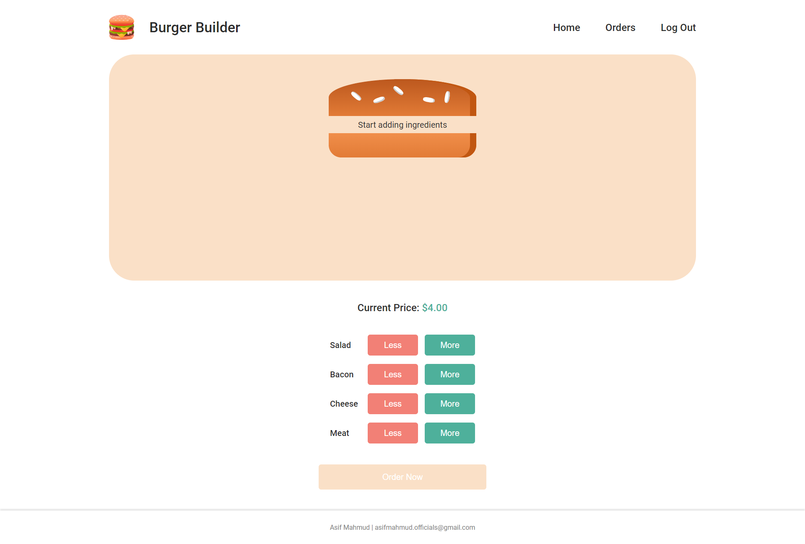
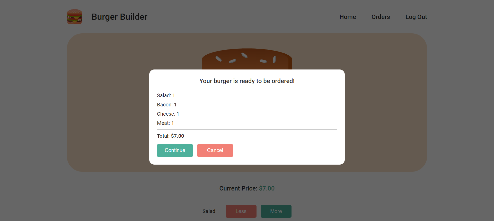
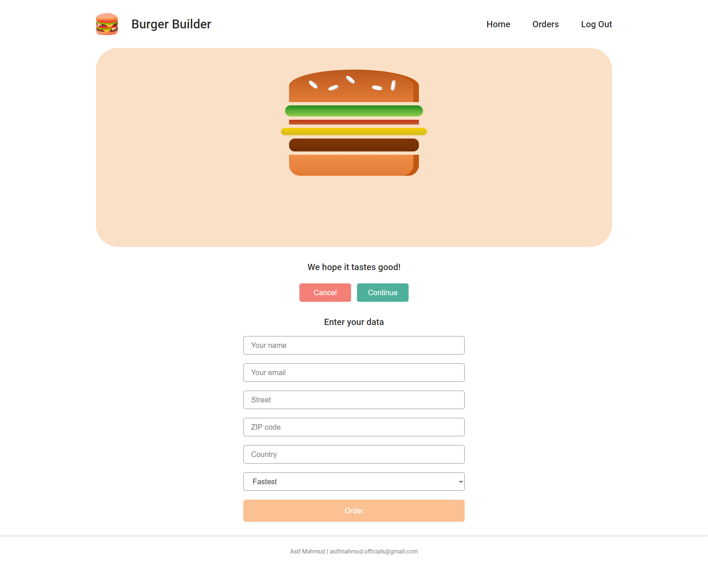
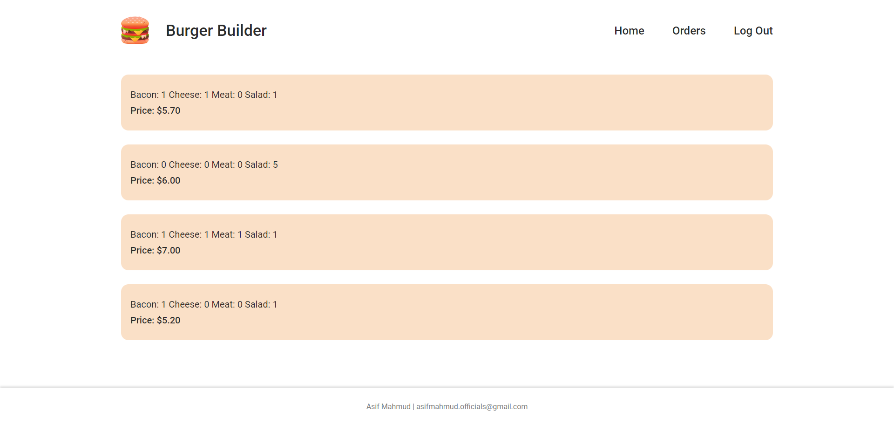
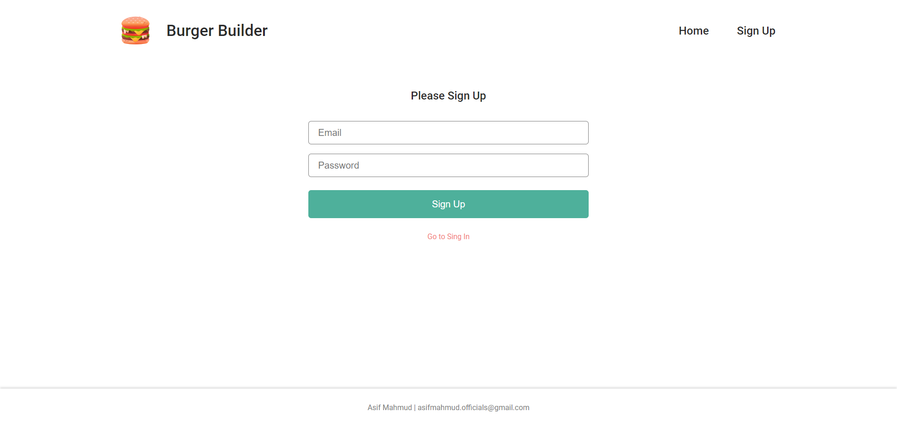

# Burger Builder

Burger builder is an application for building your own favourite burger and order it.

## Live App

Please checkout the live app here [Burger Builder](https://burger-builder-7fbdc.web.app/)

## App Features

* Build burger
* Order burger
* Authentication
* User friendly UI
* Fully responsive
* PWA feature for phones (if you add the app to the homescreen on your phone it acts like a native android / ios app)

## Technologies Used

* React
* Firebase
* Redux
* React Router
* Axios

## Quick Start

1. Clone this git repository.

2. Run `$ npm install` in your terminal from the project directory.

3. Create a `firebaseConfig.js` file in `src` folder. Create a firebase project. Copy your firebase project config as an object to `firebaseConfig.js` file. Name the object to `firebaseConfig` and `export default firebaseConfig`.

4. Run `$ npm start` in your terminal to see the project in localhost.

## Screenshots

### Home Page

### Confirm Order Page

### Input Order Details Page

### Orders List Page

### Sign up / Sign in Page
